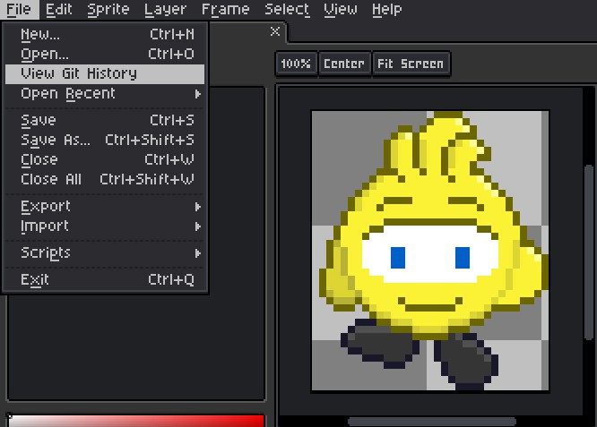
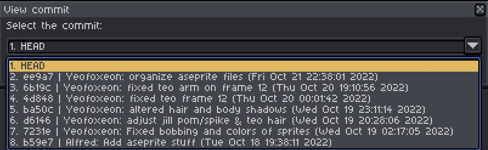

# Git Extension for Aseprite
View git histories in Aseprite.

## Usage

Open a sprite located in a git repository.

Go to `File > View Git History` and select the commit to view.

A new tab will open with a version of the sprite from that commit.

## Installation

### From release

Download `git.aseprite-extension` from a release and double-click to install.

### From source

Download the source code and zip the `src` folder.
Replace `.zip` with `.aseprite-extension` and double-click to install.